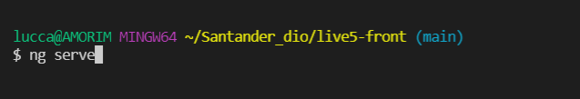
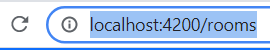
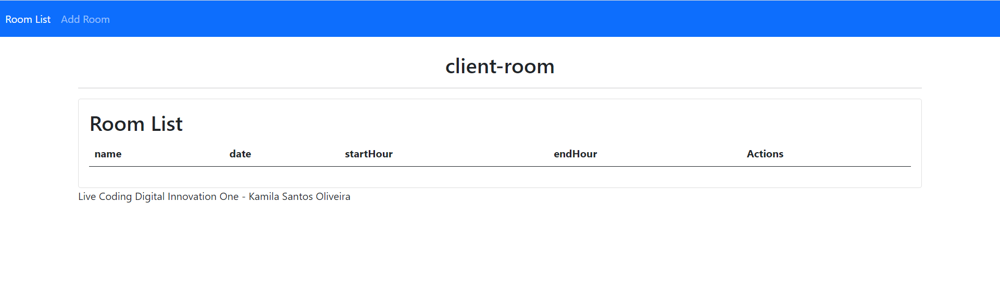

# Projeto-Dio-Live :five: :rocket: (FRONTEND)​

#### INICIO

Fala pessoal! Esta é a segunda parte do projeto da quinta live oferecido pela digital innovation one. O objetivo do projeto é montar um gerenciador de salas de reuniões utilizando os recursos do java + angular.

A primeira parte deste projeto está no repositório Projeto-Dio-Live5 (https://github.com/Amorim-cyber/Projeto-Dio-Live5), lá foi desenvolvido o backend da aplicação utilizando o spring, java e o banco de dados H2.

O desafio dentro deste repositório é criar a parte frontend do projeto utilizando o Angular.

Tenho aprendido muito com os projetos :smile:

Gratidão por todo esse conhecimento compartilhado.

Muito obrigado!

#### TECHS UTILIZADAS

* Angular
* Bootstrap
* IDE Visual Studio Code (ou outra opção se preferir)

#### INSTRUÇÕES

Para rodar o projeto localmente em sua maquina siga os seguintes passos:

1. Baixe os arquivos deste repositório

2. Execute o comando `ng serve` em seu terminal dentro do diretório deste projeto

   </img>

3. Digite `http://localhost:4200/rooms`  no seu navegador.

   </img>

4. Rode o backend do programa (https://github.com/Amorim-cyber/Projeto-Dio-Live5) para o front ter acesso a edição dos dados. **O projeto não irá iniciar de forma correta se você pular este passo**.

5. É crucial que os dois serviços(backend e angular) estejam online.

#### PRONTO

A aplicação está pronta para uso.

</img>

#### TRILHA

Segue o passo a passo mais detalhado do projeto.

   
<strong>SEGUNDO COMMIT DO PROJETO</strong>

    <ul>
        <li><strong>PARTE 8:</strong> Preparando o ambiente, utilizando o comando ng new live5_front dentro de nosso terminal para criar nossa aplicação angular frontend.</li>
    </ul>
     

 

   
<strong>CRIANDO OS COMPONENTES E CONFIGURANDO O ESTILO DO PROJETO</strong>

    <ul>
        <li><strong>PARTE 9:</strong> Criando o arquivo room.service.ts por meio do comando ng g s room. Criando o componente create-room por meio do comando ng g c create-room. Criando o componente room-details utilizando o comando ng g c room-details. Criando o componente room-list por meio do comando ng g c room-list. Criando o componente update-room por meio do comando ng g c update-room. Instalando o framework de estilização bootstrap por meio do comando npm install bootstrap jquery --save. Configurando o angular para receber os estilos e os scripts do bootstrap como padrão.</li>
    </ul>
     

 

   
<strong>CRIANDO O ARQUIVO room.ts E ESTRUTURANDO O COMPONENTE room-list</strong>

    <ul>
        <li><strong>PARTE 10:</strong> Criando o arquivo room.ts, é neste arquivo que vamos receber os dados do backend. Declarando os atributos no arquivo. Montando a estrutura HTML do componente room-list. Importando arquivos externos para dentro do arquivo room-list.component.ts. Incluindo atributos, preenchendo o construtor e criando metodos para o arquivo room-list.component.ts. Esse commit terá alguns erros visto que alguns metodos e atributos de classes externas ainda não foram criados.</li>
    </ul>
     

 

   
<strong>ESTRUTURANDO O COMPONENTE create-room</strong>

    <ul>
        <li><strong>PARTE 11:</strong> Criando a estruta HTML do componente create-room. Importando arquivos externos para dentro do arquivo create-room.component.ts por meio do import. Preenchedo o construtor e criando atributos e metodos para o arquivo create-room.component.ts. Esse commit terá alguns erros visto que alguns metodos e atributos de classes externas ainda não foram criados. </li>
    </ul>
     

 

   
<strong>ESTRUTURANDO O COMPONENTE update-room</strong>

    <ul>
        <li><strong>PARTE 12:</strong> Criando o HTML do component update-room. Importando arquivos externos aos arquivo update-room.component.ts e colocando atributos e metodos. Esse commit terá alguns erros visto que alguns metodos e atributos de classes externas ainda não foram criados. </li>
    </ul>
     

 

   
<strong>ESTRUTURANDO O SERVIÇO room.service E O COMPONENTE room-details</strong>

    <ul>
        <li><strong>PARTE 13:</strong> Colocando o conteudo HTML do componente room-details. Importando os arquivos externos para dentro do room-details.component.ts e populando atributos e metodos. Populando atributos e metodos para o room.service. Importando os arquivos. Esse commit terá alguns erros visto que alguns metodos e atributos de classes externas ainda não foram criados. </li>
    </ul>
     

   
<strong>COLOCANDO ROTAS + CORRIGINDO ERROS + CONFIGURAÇÕES FINAIS + TESTES</strong>

    <ul>
        <li><strong>PARTE 14:</strong> Mexendo no arquivo de rotas app-routing.module. Definindo todas as rotas da aplicação. Importando HttpClientModule e o FormsModule para dentro do app.module. Mudando o titulo da aplicação dentro do arquivo app.component.ts e index.html. Configurando o arquivo polyfills.ts.Os erros apresentados apresentados em commits passados foram solucionados. Colocando a estrutura HTML no arquivo app.component.html. Vendo se não houve erros da aplicação por meio do comando de inicialização ng serve. Conectando ao backend da aplicação (https://github.com/Amorim-cyber/Projeto-Dio-Live5) para realizar os testes de HTTP. </li>
    </ul>
     

FIM DA TRILHA 

#### Forte abraço! :smile:

